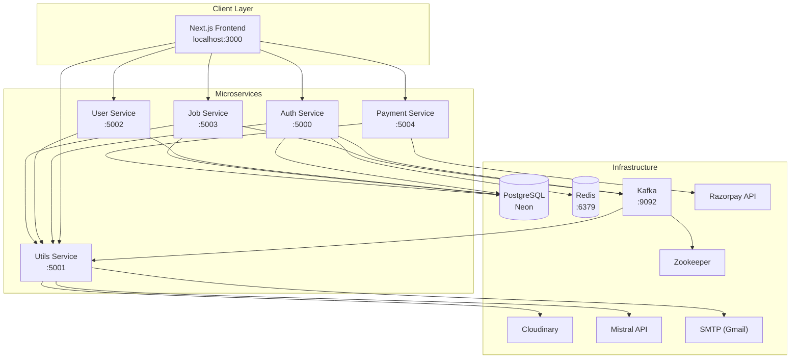
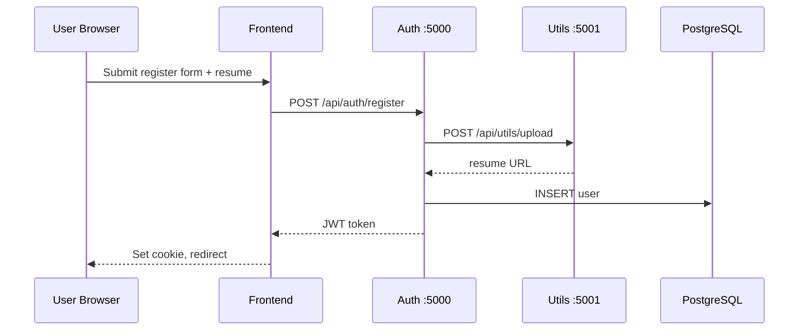
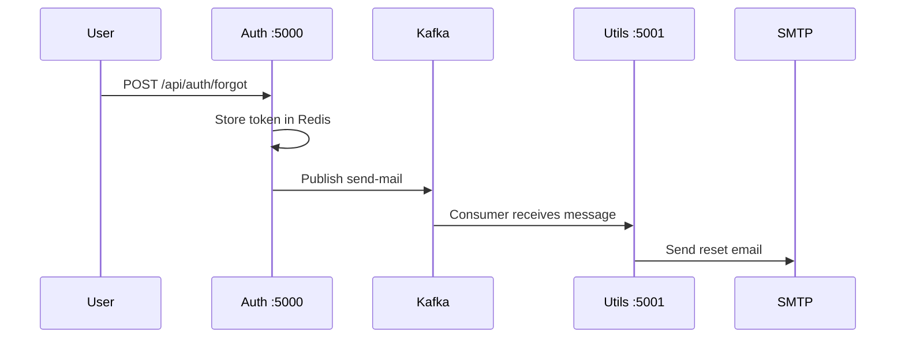
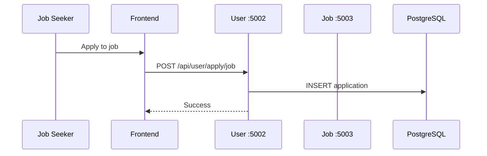

# HireHeaven — Microservice Job Portal

**HireHeaven** is a full-stack job portal built with a **microservices architecture**. Job seekers can browse roles, manage profiles, apply with resumes, and use AI-powered career tools. Recruiters can post companies and jobs, review applications, and manage hiring pipelines. Premium features are unlocked through **Razorpay** subscriptions.

---

## Table of Contents

- [Features](#features)
- [Architecture Overview](#architecture-overview)
- [System Architecture Diagram](#system-architecture-diagram)
- [Request Flow Examples](#request-flow-examples)
- [Tech Stack](#tech-stack)
- [Project Structure](#project-structure)
- [Prerequisites](#prerequisites)
- [Getting Started](#getting-started)
- [Environment Variables](#environment-variables)
- [Service Ports & API Base Paths](#service-ports--api-base-paths)
- [Running with Docker](#running-with-docker)
- [Development Scripts](#development-scripts)
- [Troubleshooting](#troubleshooting)

---

## Features

### Job Seekers
- Register / login with JWT authentication
- Upload resume and profile picture
- Browse and apply to active job listings
- Track application status (Submitted, Rejected, Hired)
- Manage skills on profile
- **AI Career Guide** — skill-based career path suggestions (Mistral)
- **AI Resume Analyzer** — ATS-style resume scoring and feedback

### Recruiters
- Register as recruiter and create company profiles
- Post, update, and manage job listings
- Review applicants per job and update application status
- Email notifications to applicants (via Kafka → Utils mail consumer)

### Platform
- Password reset flow with Redis-backed tokens
- Async email delivery through **Apache Kafka**
- File uploads via **Cloudinary** (or local fallback in Utils service)
- **Razorpay** subscription checkout (₹119) with dev-mode fallback

---

## Architecture Overview

The application follows a **distributed microservices** pattern:

| Layer | Responsibility |
|--------|----------------|
| **Frontend** | Next.js SPA; calls backend services directly by URL (no API gateway in-repo) |
| **Auth Service** | Registration, login, JWT issuance, forgot/reset password, Redis session for reset tokens |
| **User Service** | Profiles, skills, resume/picture updates, job applications |
| **Job Service** | Companies, jobs, applications, recruiter workflows |
| **Payment Service** | Razorpay orders and payment verification; updates user subscription |
| **Utils Service** | File uploads, Mistral AI routes, Kafka mail consumer |
| **Infrastructure** | PostgreSQL (Neon), Redis, Kafka + Zookeeper (via Docker Compose) |

Each service owns its Express API, shares **JWT** validation with a common `JWT_SEC`, and uses **Neon PostgreSQL** (`@neondatabase/serverless`) for persistence. Database tables are created automatically on service startup.

---

## System Architecture Diagram



---

## Request Flow Examples

### User registration (job seeker with resume)



### Forgot password email (async)



### Job application



---

## Tech Stack

| Category | Technologies |
|----------|----------------|
| Frontend | Next.js 16, React 19, TypeScript, Tailwind CSS, Radix UI, Axios |
| Backend | Node.js, Express 5, TypeScript |
| Database | PostgreSQL (Neon serverless driver) |
| Cache | Redis (password-reset tokens) |
| Messaging | Apache Kafka (KafkaJS) |
| Auth | JWT, bcrypt |
| Payments | Razorpay |
| Storage | Cloudinary (+ local upload fallback) |
| AI | Mistral (`fetch` to Mistral API) |
| Email | Nodemailer (SMTP) |
| DevOps | Docker, Docker Compose |

---

## Project Structure

```
job-portal/
├── docker-compose.yml      # Redis, Zookeeper, Kafka
├── frontend/               # Next.js application
│   └── src/
│       ├── app/            # Pages (jobs, account, auth, subscribe, …)
│       ├── components/     # UI components
│       └── context/        # AppContext (service URLs, auth state)
└── services/
    ├── auth/               # Authentication & user table bootstrap
    ├── user/               # Profiles, skills, applications
    ├── job/                # Companies, jobs, hiring
    ├── payment/            # Razorpay subscription
    └── utils/              # Uploads, AI, Kafka mail consumer
```

---

## Prerequisites

Install the following before running the project locally:

- **Node.js** 18+ (22 recommended for Docker builds)
- **npm**
- **Docker Desktop** (for Redis and Kafka)
- **PostgreSQL** connection string ([Neon](https://neon.tech) or local Postgres)
- Optional accounts:
  - [Cloudinary](https://cloudinary.com) — image/resume hosting
  - [Mistral](https://www.mistral.ai/) — Mistral API key
  - [Razorpay](https://razorpay.com) — payments (test keys work for dev)
  - Gmail app password — SMTP for password-reset emails

---

## Getting Started

### 1. Clone and enter the project

```bash
cd job-portal
```

### 2. Start infrastructure (Redis + Kafka)

From the `job-portal` directory:

```bash
docker compose up -d
```

This starts:
- **Redis** on `localhost:6379`
- **Kafka** on `localhost:9092`
- **Zookeeper** (internal, required by Kafka)

### 3. Configure environment variables

Each microservice uses its own `.env` file under `services/<service-name>/.env`.

Create or copy `.env` files and set the variables listed in [Environment Variables](#environment-variables).  
**Important:** Use the same `JWT_SEC` across auth, user, job, and payment services.

### 4. Install dependencies and build backend services

Run these in **each** service folder (`auth`, `user`, `job`, `payment`, `utils`):

```bash
cd services/auth
npm install
npm run build

cd ../user
npm install
npm run build

cd ../job
npm install
npm run build

cd ../payment
npm install
npm run build

cd ../utils
npm install
npm run build
```

### 5. Start all microservices

Open **five separate terminals** (or use a process manager like `concurrently` at the root):

```bash
# Terminal 1 — Utils (start first: uploads + mail consumer)
cd services/utils && npm run dev

# Terminal 2 — Auth
cd services/auth && npm run dev

# Terminal 3 — User
cd services/user && npm run dev

# Terminal 4 — Job
cd services/job && npm run dev

# Terminal 5 — Payment
cd services/payment && npm run dev
```

Wait until you see successful logs (database tables created, Kafka connected, Redis connected).

### 6. Start the frontend

```bash
cd frontend
npm install
npm run dev
```

Open **[http://localhost:3000](http://localhost:3000)** in your browser.

### 7. Verify services

| Service | Health check |
|---------|----------------|
| Auth | `http://localhost:5000` (service logs on start) |
| Utils | `http://localhost:5001` |
| User | `http://localhost:5002` |
| Job | `http://localhost:5003` |
| Payment | `http://localhost:5004` |
| Frontend | `http://localhost:3000` |

Service URLs are defined in `frontend/src/context/AppContext.tsx`. Update them if you change ports.

---

## Environment Variables

Never commit real secrets to git. Use placeholders in `.env` files.

### Auth (`services/auth/.env`)

| Variable | Description |
|----------|-------------|
| `PORT` | Default: `5000` |
| `DB_URL` | Neon/PostgreSQL connection string |
| `JWT_SEC` | Shared JWT secret (must match other services) |
| `UPLOAD_SERVICE` | Utils base URL, e.g. `http://localhost:5001` |
| `Kafka_Broker` | e.g. `localhost:9092` |
| `Frontend_Url` | e.g. `http://localhost:3000` |
| `Redis_url` | e.g. `redis://localhost:6379` |

### User (`services/user/.env`)

| Variable | Description |
|----------|-------------|
| `PORT` | Default: `5002` |
| `DB_URL` | PostgreSQL connection string |
| `JWT_SEC` | Same as auth service |
| `UPLOAD_SERVICE` | Utils service URL |

### Job (`services/job/.env`)

| Variable | Description |
|----------|-------------|
| `PORT` | Default: `5003` |
| `DB_URL` | PostgreSQL connection string |
| `JWT_SEC` | Same as auth service |
| `UPLOAD_SERVICE` | Utils service URL |
| `Kafka_Broker` | e.g. `localhost:9092` |

### Payment (`services/payment/.env`)

| Variable | Description |
|----------|-------------|
| `PORT` | Default: `5004` |
| `DB_URL` | PostgreSQL connection string |
| `JWT_SEC` | Same as auth service |
| `Razorpay_Key` | Razorpay key ID |
| `Razorpay_Secret` | Razorpay key secret |

Frontend checkout also uses `NEXT_PUBLIC_RAZORPAY_KEY` (optional `.env.local` in `frontend/`).

### Utils (`services/utils/.env`)

| Variable | Description |
|----------|-------------|
| `PORT` | Default: `5001` |
| `CLOUD_NAME` | Cloudinary cloud name |
| `API_KEY` | Cloudinary API key |
| `API_SECRET` | Cloudinary API secret |
| `Kafka_Broker` | e.g. `localhost:9092` |
| `SMTP_USER` | Gmail address for outbound mail |
| `SMTP_PASS` | Gmail app password |
| `API_KEY_MISTRAL` | Mistral API key |
| `MISTRAL_MODEL` | Optional comma-separated model list |
| `MISTRAL_BASE_URL` | Optional Mistral base URL (defaults to https://api.mistral.ai/v1) |
| `ATS_USE_LOCAL` | Set `true` to use local ATS analysis without Mistral |

---

## Service Ports & API Base Paths

| Service | Port | Base path | Main endpoints |
|---------|------|-----------|----------------|
| Auth | 5000 | `/api/auth` | `POST /register`, `/login`, `/forgot`, `/reset/:token` |
| Utils | 5001 | `/api/utils` | `POST /upload`, `/career`, `/resume-analyser` |
| User | 5002 | `/api/user` | `GET /me`, `PUT /update/*`, `POST /apply/job`, skills |
| Job | 5003 | `/api/job` | Companies, jobs, applications |
| Payment | 5004 | `/api/payment` | `POST /checkout`, `/verify` |
| Frontend | 3000 | — | Next.js App Router pages |

Protected routes expect header: `Authorization: Bearer <token>` (stored in cookies on the frontend).

---

## Running with Docker

### Infrastructure only (recommended for local dev)

```bash
docker compose up -d
```

### Auth service container (example)

The auth service includes a multi-stage `Dockerfile`:

```bash
cd services/auth
docker build -t hireheaven-auth .
docker run --env-file .env -p 5000:5000 hireheaven-auth
```

Ensure Redis, Kafka, Postgres, and Utils are reachable from the container (adjust host URLs in `.env` accordingly, e.g. `host.docker.internal` on Windows/Mac).

---

## Development Scripts

Each backend service (`package.json`):

| Script | Purpose |
|--------|---------|
| `npm run build` | Install deps + compile TypeScript to `dist/` |
| `npm run dev` | Watch-compile TypeScript + nodemon on `dist/index.js` |
| `npm start` | Run production build (`node dist/index.js`) |

Frontend:

| Script | Purpose |
|--------|---------|
| `npm run dev` | Start Next.js dev server |
| `npm run build` | Production build |
| `npm start` | Serve production build |

---

## Troubleshooting

| Issue | What to check |
|-------|----------------|
| "Cannot reach the server" on frontend | All five backend services running; ports match `AppContext.tsx` |
| Kafka connection errors | `docker compose up -d`; `Kafka_Broker=localhost:9092` |
| Redis errors on forgot-password | Redis container running on port 6379 |
| Upload failures | Utils service up; Cloudinary credentials valid or local fallback active |
| AI features return sample data | Set `API_KEY_MISTRAL` or use `ATS_USE_LOCAL=true` |
| Payment dev mode | Razorpay keys missing — service returns mock orders (see payment logs) |
| JWT / 401 errors | Same `JWT_SEC` in auth, user, job, and payment `.env` files |
| Emails not sent | Utils consumer running; SMTP credentials correct; Kafka topic `send-mail` |

---

## License

This project is provided as source code for learning and development. Add your preferred license before public distribution.

---

## Contributing

1. Fork the repository  
2. Create a feature branch  
3. Commit changes (do not commit `.env` files or secrets)  
4. Open a pull request  

---

**Happy hiring with HireHeaven.**
